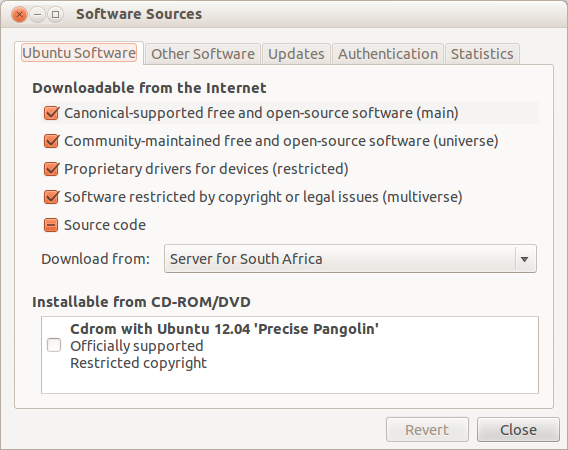

=====================
 Dlab Administration
=====================

Imaging
=======
This is a guide to clonezilla specific to the Dlab. Clonezilla is a
partition and disk imaging/cloning program. It comes in two types,
Clonezilla Live and Clonezilla Server Edition. Clonezilla Live comes
as a CD. It is useful for single machine cloning and deploying.
Clonezilla Server Edition is installed on a server. It is great for
general cloning and deploying. This guide provides a guide for
Clonezilla Server Edition.

Clonezilla Server Edition (SE)
------------------------------
  **Requirements :**
    - Ubuntu 12.04 (LTS)

      The server should have clonezilla installed, see below for
      installation instructions

Clonezilla SE Installation
--------------------------
To install Clonezilla Server Edition (SE) you need to first install
the Diskless Remote Boot in Linux Server (DRBL Server).
Detailed instructions on how to go about this can be found on the
`drbl installation site`_ . What follows is an attempt at simplifying
the instructions for Dlab use. I assume knowledge of linux terminal
commands.

  **Requirements :**
    - Ubuntu 12.04 (LTS)

#. Get the key::

     sudo wget -q http://drbl.org/GPG-KEY-DRBL -O- | sudo apt-key add -

The output from this should be `OK`.

#. Enable universe, mutliverse and restricted from Software Center
   sources. Open the Software Center. Then `Edit >> Software
   Sources...` then make sure universe, restricted and multiverse are
   checked (you will have to enter the support password). I think
   there will be a screenshot below.

#. Add the repository for downloading DRBL. This requires editing the
   `/etc/apt/sources.list`. Unfortunatetly I don't want to risk giving
   a single command for this like `cat blah >> /etc/apt/sources.list`
   so you will have to edit the file yourself. I like `vim` as my text
   editor but some prefer `gedit`. Paste the following at the end of
   the file `/etc/apt/sources.list`. This command will open `gedit` for
   you::

     gksudo gedit /etc/apt/sources.list

   then add this to the bottom::

     deb http://drbl.sourceforge.net/drbl-core drbl stable

#. Update your sources cache::

     sudo apt-get update

#. Install DRBL::

     sudo apt-get install drbl

.. note::

   if you're lazy like me, you can run `sudo apt-get update && sudo
   apt-get install drbl` instead of the last two steps separatetly.

Clonezilla SE configuration
---------------------------

Preliminary setup:
Make sure there is a `/home/support/Imaging/macadr-eth0.txt` and
`/home/support/Imaging/macadr-eth1.txt`. This will make life easier
later. I put the dlab computers from 1 to 42 in `macadr-eth0.txt` and
dlab computers 43 to 77 and all 10 Blab computers in
`macadr-eth1.txt`.

You need to have a list of MAC addresses for ALL the machines that
will EVER be cloned. If you get new machines, you have to run this
step again.

.. note::

   you only ever have to configure the server once. Unless you get new
   machines.

.. warning::

   Make sure both network cards are connected

To configure the DRBL server you run::

  sudo drblsrv -i

#. Do you want to install the network installation boot image....
ANSWER: N
#. Do you want to use the serial console...
ANSWER: N
#. Do you want to upgrade the operating systems?
ANSWER: N
#. There are 2 kernels available for clients, which on do you prefere?
ANSWER: 1
the one "from this DRBL server"

Thats not all, you now need to run drblpush, to actually, uhm... I
guess configure. This will ask you a whole lot of questions and one of
them is the one that needs the MAC addresses::

  sudo drblpush -i

#. Please enter DNS domain
ANSWER: ug.eie.wits.ac.za
#. Please enter NIS/YP domain name
ANSWER: hotseat2
#. Please enter the client hostname prefix
ANSWER: hotseat2
#. ... Do you want to collect them?
ANSWER: N
#. Do you want to let the DHCP service ... interface eth0 ?
ANSWER: Y
#. Please tell me the file name which contains MAC addresses...
ANSWER: /home/support/Imaging/macadr-eth0.txt
#. What initial number to use in the last set of digits...
ANSWER 1
#. Do you want to let the DHCP service ... interface eth1 ?
ANSWER: /home/support/Imaging/macadr-eth1.txt
#. What initial number to use in the last set of digits...
ANSWER 43
#. In the system, there are 3 modes for diskless linux services...
ANSWER: 2
#. In the system, there are 4 modes available for clonezilla...
ANSWER: 1
#. When using clonezilla, which directory ... save the image
ANSWER: /home/partimag
#. Do you want to set the pxelinux password for clients...
ANSWER: N
#. Do you want to set boot prompt for clients?
ANSWER: N
#. Do you want to use graphic background for PXE menu when clients
   boot?
ANSWER: Y
#. Do you want to let DRBL server as a NAT server...
ANSWER: N
#. Warning! If you go on, your firewall rules will be overwritten...
ANSWER: Y

Clonezilla Live
---------------
These instructions were taken from the "Complete Guide to Cloning" by
*Tebogo Mohotlhoane*
  **Requirements :**
    - Clonezilla live disc
    - external hard disc.

.. note::

  Clonezilla will compress the device with the ratio 2.4:1 (approximated!). So to
  create an image of a device with 24GB of data, ensure that the external disc has at least
  10GB of free space.

#. Load the Clonezilla live disc onto the DVD-ROM drive. Plug in the external disc at
   this point.
#. Reboot the system and press F12 before the BIOS loads.
#. On the Boot Device Menu, select the 'Onboard or USB CD-ROM Drive' option. If
   the latter is not listed, go to 'System Setup > General > Boot Sequence' and check the
   box for the required option. Apply the changes, exit System Setup and repeat step 2.
#. Select each of the following options on the menus that appear:

   - Clonezilla live (default option)
   - en_US
   - don't touch keymap
   - Start_Clonezilla
   - device-image (since we want to create an image)
   - local_dev (we will be storing the image on the external disc. Ensure that the
     device is plugged in and connected to the system, then press 'Enter' to
     proceed)

.. note::

   The system drive containing the OS (sda – system device a?)
   will be listed first with all its partitions (a1, a5, a6 etc.). All other drives will
   come afterwards taking up the letters b, c, etc. If the system has only one
   drive (a), then the external disk will be sdb (sdb1 if it is not partitioned). An
   easier way is to use partition sizes.

   / Top_directory_in_the_local_device (the image can be moved
   afterwards)

#. To continue
  - Press 'Enter' to continue.
  - Beginner (simplest mode – sets best options as default on subsequent menus)
  - Note: can either
  - create an image of an entire disc as well as one or more partitions of a disc.
    For a disc:

     * select 'savedisk'
     * name the image being created. Use the convention shown as it will make
       identifying the image simpler.
     * select the disc to be cloned. Remember from point (vii) that our OSes are
       on sda. Press 'Enter' to proceed
  - confirm the procedure with 'y' followed by 'Enter'
  - once complete, press '0' (to shut the system down) or '1' (to reboot)
    followed by 'Enter'
    For partition imaging:
    * select 'saveparts'
    * name the image being created. Use the convention shown as it will
      make identifying the image simpler.
  - mark the partitions to be imaged using the spacebar to check the
    boxes. Press 'Enter' twice to continue
    * confirm the procedure with 'y' followed by 'Enter'
    * once complete, press '0' (to shut the system down) or '1' (to reboot)
      followed by 'Enter'
      remove the disc, close the tray and press 'Enter'

.. _drbl installation site: http://drbl.sourceforge.net/installation/

.. toctree::
   :maxdepth: 2
